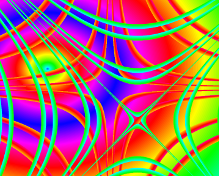
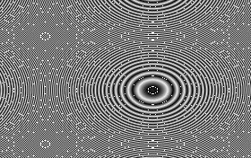

## VPixels
If you like doodling and programming, VPixels is a tool for you. You can use
it to generate BMP and animated GIF images. The following are examples
generated using VPixels. VPixels allows you to manipulate every pixel in your
image. Use your imagination and creativity, you may write programs to generate
even better and stunning ones.

  

Written in C++, VPixels also provides programming interfaces to scripting language
Lua and Python. Choose the one you prefer, C++, Lua or Python.

## License
GNU General Public License version 3 or any later version.
Please see license terms in file COPYING.

## Table of contents
* [Repo Directories](#repo-directories)
* [Examples](#examples)
* [Build and Install](#build-and-install)
  * [Prerequisite](#prerequisite)
  * [Build with Autotools](#build-with-autotools)
  * [Build with CMake](#build-with-cmake)
* [Lua API](#lua-api)
  * [Import VPixels module](#import-vpixels-module)
  * [Methods of BMP object](#methods-of-bmp-object)
  * [Methods of GIF object](#methods-of-gif-object)
  * [Methods of GIF image object](#methods-of-gif-image-object)
  * [Extend or customize BMP and GIF object](#extend-or-customize-bmp-and-gif-object)
* [Python API](#python-api)

## Repo Directories
```
  example/  - examples of using VPixels in C++, Lua and Python
  include/  - C++ header files
  src/      - C++ source files
  test/     - tests
  cmake/    - files for CMake build
```

## Examples
```
  example/cpp/       - examples in C++
    BmpInfo.cpp      - show information of a BMP file
    GifDownsize.cpp  - downsize a GIF file
    GifImages.cpp    - extract images(frames) from a GIF file
    GifInfo.cpp      - show information of a GIF file
  example/lua/       - example Lua scripts
    circularity.lua  - generate a BMP file consisting of circular shapes
    hourglass.lua    - generate a GIF file of animated hourglass
  example/py/        - example Python scripts
    circularity.py   - generate a BMP file consisting of circular shapes
    hourglass.py     - generate a GIF file of animated hourglass
```

## Build and Install

If you use Windows and do not want to build from source, you can download Windows DLL
files from [releases](https://github.com/xmartin-yao/vpixels/releases).
Simply save them to the same directory where your Lua or Python scripts are located.
Alternatively, save `vpixels.dll` to the directory where Lua interpreter is installed,
if you use Lua; or save `vpixels.pyd` to the directory `<Python Installation>/Lib/site-packages/`,
if you use Python. 

**[New in version 0.7.0]**\
[Release](https://github.com/xmartin-yao/vpixels/releases/tag/v0.7.0)
includes wheel files for Python users to install using `pip` tool.

### Prerequisite
* [Lua 5.2](https://www.lua.org/ftp/)
* [Python 2.7 or 3.x](https://www.python.org/downloads/)

### Optional (for running tests)
* [CppUnit](https://freedesktop.org/wiki/Software/cppunit/)
* [LuaUnit](https://github.com/bluebird75/luaunit)
* PyUnit

### Build with Autotools
(From [releases](https://github.com/xmartin-yao/vpixels/releases) you can download
a tarball `vpixels-<version>.tar.gz` that already includes Autotools configuration files,
unpack it using `tar -xf vpixels-<version>.tar.gz`, change to the newly created
directory `vpixels-<version>/`, and start from step 6.)
1. Clone the repository
2. Change to the directory `vpixels/`
3. Create directory `m4/`
4. Download the following files into directory `m4/`
   * [ax_cxx_compile_stdcxx.m4](https://www.gnu.org/software/autoconf-archive/ax_cxx_compile_stdcxx.html)
   * [m4_ax_compiler_vendor.m4](https://www.gnu.org/software/autoconf-archive/ax_compiler_vendor.html)
   * [m4_ax_compiler_version.m4](https://www.gnu.org/software/autoconf-archive/ax_compiler_version.html)
5. Generate configuration files
    ``` sh
    $ autoreconf -i
    ```
6. Create a build directory, e.g. `_build`, and change to it
    ``` sh
    $ mkdir _build
    $ cd _build
    ```
7. Configure the package (run `../configure --help` for options)\
   To build with Python 2.7
    ``` sh
    $ ../configure
    ```
   or with Python 3.x
    ``` sh
    $ ../configure PY_VERSION=3
    ```
   or with a specific version, e.g. `3.8`, of Python
    ``` sh
    $ ../configure PY_VERSION=3.8
    ```
8. Build and install the package
    ``` sh
    $ make && make install
    ```
9. Run tests (optional)
    ``` sh
    $ make check
    ```
10. Pack Python module into a wheel file (optional)
    ``` sh
    $ cd src/py
    $ make pack-py
    ```
### Build with CMake
1. Clone the repository
2. Change to the directory `vpixels/`
3. Create a build directory, e.g. `_build`, and change to it
    ``` sh
    $ mkdir _build
    $ cd _build
    ```
4. Configure the package, e.g. using `"Unix Makefiles"` generator\
   To build with Python 2.7
    ``` sh
    $ cmake .. -G "Unix Makefiles"
    ```
   or with Python 3.x
    ``` sh
    $ cmake .. -G "Unix Makefiles" -DPY_VERSION=3
    ```
   or with a specific version, e.g. 3.8, of Python
    ``` sh
    $ cmake .. -G "Unix Makefiles" -DPY_VERSION=3.8
    ```
5. Build the package
    ``` sh
    $ make
    ```
6. Run tests (optional)
    ``` sh
    $ make check
    ```
7. Pack Python module into a wheel file (optional)
    ``` sh
    $ make pack-py
    ```

## Lua API
Please see examples in directory `example/lua/`

### Import VPixels module
```
   vpixels = require("vpixels")
```

### Methods of BMP object
* Create a BMP object
```
     bmp = vpixels.bmp(bpp, w, h)  -- create a bmp object 
     -- bpp: bits/pixel, support 1, 4, 8 and 24
     -- w: image width
     -- h: image height

     bmp = vpixels.bmp()   -- create a bmp object, bpp = 1, w = 1, h = 1

     bmp = bmp_old:clone() -- create a bmp object from an existing one (bmp_old)
```

* Import from/export to a BMP file
```
     bmp:import("file_name.bmp")
     bmp:export("file_name.bmp", ow)
     -- ow: optional. if true, allow overwriting; default = false
```

* Queries
```
     bpp = bmp:bitsperpixel()  -- query bits/pixel
     bpp = bmp:bpp()           -- same as bmp:bitsperpixel()

     w = bmp:width()           -- query image width
     h = bmp:height()          -- query image height
     w, h = bmp:dimension()    -- query image width and height
```

* Access color table, when bits/pixel = 1, 4, or 8
```
     size = bmp:colortablesize() -- get color table size

     bmp:setcolortable(i, b, g, r) -- set a color table entry
     bmp:setcolor(i, b, g, r)      -- same as bmp:setcolortable( i, b, g, r )

     b, g, r = bmp:getcolortable( i ) -- get a color table entry
     b, g, r = bmp:getcolor(i)        -- same as bmp:getcolortable(i)

     -- size: color table size (i.e. the number of entries)
     -- i: index of the entry, within range [0, size)
     -- b: blue channel, within range [0, 255]
     -- g: green channel, within range [0, 255]
     -- r: red channel, within range [0, 255]
```

* Access pixels, when bits/pixel = 1, 4, or 8
```
     bmp:setallpixels(i)     -- set all pixels to the same color
     bmp:setall(i)           -- same as bmp:setallpixels(i)

     bmp:setpixel(x, y, i)   -- set color of a pixel

     i = bmp:getpixel(x, y)  -- get color of a pixel

     -- i: index of a color table entry, within range [0, size)
     -- x: x coordinate of the pixel, within range [0, width)
     -- y: y coordinate of the pixel, within range [0, height)
```

* Access pixels, when bits/pixel = 24
```
     bmp:setallpixels(b, g, r)     -- set all pixels to the same color
     bmp:setall(b, g, r)           -- same as bmp:setallpixels(b, g, r)

     bmp:setpixel(x, y, b, g, r)   -- set color of a pixel

     b, g, r = bmp:getpixel(x, y)  -- get color of a pixel

     -- b: blue channel, within range [0, 255]
     -- g: green channel, within range [0, 255]
     -- r: red channel, within range [0, 255]
     -- x: x coordinate of the pixel, within range [0, width)
     -- y: y coordinate of the pixel, within range [0, height)
```

### Methods of GIF object
* Create a GIF object
```
     gif = vpixels.gif(bpp, w, h, n, g)  -- create a GIF object
     -- bpp: bits/pixel, within range [2, 8]
     -- w: GIF canvas width
     -- h: GIF canvas height
     -- n: number of images(frames)
     -- g: global color table, when g = true

     gif = vpixels.gif(bpp, w, h)  -- create a GIF object, n = 1, g = true

     gif = vpixels.gif()    -- create a GIF object, bpp = 2, w = 1, h = 1, n = 1, g = true

     gif = gif_old:clone()  -- create a GIF object from existing one (gif_old)
```

* Import from/export to a GIF file
```
     gif:import("file_name.gif")
     gif:export("file_name.gif", ow)
     -- ow: optional. if true, allow overwriting; default = false
```

* Queries
```
     v = gif:version()         -- query GIF version

     bpp = gif:bitsperpixel()  -- query bits/pixel
     bpp = gif:bpp()           -- same as gif:bitsperpixel()

     w = gif:width()           -- query GIF canvas width
     h = gif:height()          -- query GIF canvas height
     w, h = gif:dimension()    -- query GIF canvas width and height

     size = gif:size()         -- query size of the resulting GIF file
```

* Access global color table
```
     gif:colortable() -- true, if the GIF object has a global color table

     gif:colortablesize(size)    -- set color table size
     size = gif:colortablesize() -- get color table size

     gif:setcolortable(i, r, g, b) -- set a color table entry
     gif:setcolor(i, r, g, b)      -- same as gif:setcolortable( i, r, g, b )

     r, g, b = gif:getcolortable( i ) -- get a color table entry
     r, g, b = gif:getcolor(i)        -- same as gif:getcolortable(i)

     -- size: color table size (i.e. the number of entries)
     -- i: index of the entry, within range [0, size)
     -- r: red channel, within range [0, 255]
     -- g: green channel, within range [0, 255]
     -- b: blue channel, within range [0, 255]
```

* Access images(frames)
```
     n = gif:images() -- get the number of images(frames)
     n = #gif         -- same as gif:images()

     img = gif:getimage(i) -- get an image(frame)
     img = gif[i]          -- same as gif:getimage(i)

     gif:removeimage(i) -- remove an image(frame)
     gif:remove(i)      -- same as gif:removeimage(i)
     gif[i] = nil       -- same as gif:removeimage(i)

     for i, img in ipairs(gif) do  -- iterate over all images
       -- put code here
     end

     -- n: number of images(frames)
     -- i: index of the image(frame), within range [0, n)
     -- img: image(frame) at index i
```

### Methods of GIF image object

* Copy a GIF image(frame) object
```
     img2:clone(img1)      -- img2 copies img1
     gif[2]:clone(img1)    -- gif[2] copies img1
     gif[2]:clone(gif[1])  -- gif[2] copies gif[1]
     gif[2] = img1         -- gif[2] copies img1
     gif[2] = gif[1]       -- gif[2] copies gif[1]

     -- the following are not copying
     img2 = gif[0] -- img2 now is the 1st image in gif
     img2 = img1   -- img2 now references the same value as img1 does
```

* Bits/pixel
```
     bpp = img:bitsperpixel()  -- query bits/pixel of the image(frame)
     bpp = img:bpp()           -- same as img:bitsperpixel()
```

* Origin and dimension
```
     l = img:left()            -- query x coordinate of the image(frame)
     t = img:top()             -- query y coordinate of the image(frame)

     w = img:width()           -- query width of the image(frame)
     h = img:height()          -- query height of the image(frame)
     w, h = img:dimension()    -- query width and height of the image(frame)
```

* Disposal method
```
     m = img:disposalmethod()  -- query disposal method
     m = img:disposa()         -- same as img:disposalmethod()
     img:disposalmethod(m)     -- set disposal method
     img:disposa(m)            -- same as img:disposalmethod(m)

     -- disposal method
     --   m = 0, disposal method not specified
     --   m = 1, image is drawn on top of previous
     --   m = 2, image is drawn after screen is restored to background color
     --   m = 3, image is drawn after screen is restored to the state before previous was draw
```

* Transparent color
```
     img:hastransparentcolor()     -- true, if img has transparent color enabled
     img:hastranscolor()           -- same as img:hastransparentcolor()
     img:hastransparentcolor(yes)  -- enable transparent color, if yes == true
                                   -- disable transparent color, if yes == false
     img:hastranscolor(yes)        -- same as img:hastransparentcolor(yes)

     i = img:transparentcolor()  -- get transparent color
     i = img:transcolor()        -- same as img:transparentcolor()
     img:transparentcolor(i)     -- set transparent color
     img:transcolor(i)           -- same as img:transparentcolor(i)

     -- i: index of transparent color
```

* Access local color table
```
     img:colortable() -- true, if the image(frame) has a local color table

     img:colortablesize(size)    -- set color table size
     size = img:colortablesize() -- get color table size

     img:setcolortable(i, r, g, b) -- set a color table entry
     img:setcolor(i, r, g, b)      -- same as bmp:setcolortable( i, r, g, b )

     r, g, b = img:getcolortable( i ) -- get a color table entry
     r, g, b = img:getcolor(i)        -- same as bmp:getcolortable(i)

     -- size: color table size (i.e. the number of entries)
     -- i: index of the entry, within range [0, size)
     -- r: red channel, within range [0, 255]
     -- g: green channel, within range [0, 255]
     -- b: blue channel, within range [0, 255]
```

* Access pixels
```
     img:setallpixels(i)     -- set all pixels to the same color
     img:setall(i)           -- same as img:setallpixels(i)

     img:setpixel(x, y, i)   -- set color of a pixel

     i = img:getpixel(x, y)  -- get color of a pixel

     img:transparent(x, y)   -- true, if a pixel is transparent
     img:trans(x, y)         -- same as img:transparent(x, y)

     -- i: index of a color table entry, within range [0, size)
     -- x: x coordinate of the pixel, within range [0, width)
     -- y: y coordinate of the pixel, within range [0, height)
```

* Crop GIF image(frame)
```
     img:crop(l, t, w, h)

     -- l: x coordinate of the cropped image(frame), must be within GIF canvas
     -- t: y coordinate of the cropped image(frame), must be within GIF canvas
     -- w: with of the cropped image(frame), l + w must be within GIF canvas
     -- h: height of the cropped image(frame), t + h must be within GIF canvas
```

* Operator "**==**" and "**~=**"
```
     img1 == img2  -- true, if img1 and img2 satisfy
                   -- 1) they have the same origin and dimension; and
                   -- 2) corresponding pixels are transparent or have the same RGB.

     img1 ~= img2  -- negation of img1 == img2
```

### Extend or customize BMP and GIF objects
Data and methods can added to BMP and GIF objects. If the name of the added method 
collides with the name a built-in method, the built-in method still can be accessed
with key named "base".
```
     -- create a BMP object
     bmp = vpixels.gif(4, 120, 60)

     -- add a data field
     bmp.pi = 3.14

     -- add a method
     function bmp:bitsperpixel()  -- this method overrides the one built in BMP object
       return self.pi
     end

     x = bmp.pi               -- get the newly added data
     bmp:bitsperpixel()       -- call the newly added method
     bmp.base:bitsperpixel()  -- call the built-in one
```

## Python API
**[New in version 0.7.0]**\
Python API is documented using docstrings, please use help() function for details.\
For example:
```
  import vpixels as vp

  help(vp)  # doc of the module

  help(vp.bmp)      # doc of vpixels.bmp class
  help(vp.bmp.bpp)  # doc of method bpp() of the class

  help(vp.gif)      # doc of vpixels.gif class
  help(vp.gif.bpp)  # doc of method bpp() of the class

  help(vp.gifimage)      # doc of vpixels.gifimage class
  help(vp.gifimage.bpp)  # doc of method bpp() of the class
```

Please see examples in directory `example/py/`

The signatures of the methods of Python API are almost the same as those of Lua API,
except the following that differ.

* Because _**import**_ is reserved in Python, use _**importf**_
instead as the name of the methods.
```
     bmp.importf("file_name.bmp")  # import from a BMP file
     gif.importf("file_name.gif")  # import from a GIF file
```

* Python does not have operator **#**, use _**len**_ instead.
```
     n = len(gif)  # get the number of images(frames)
```

* Python uses "**!=**", instead of "**~=**", as unequal operator
```
     img1 != img2
```

* Remove an image(frame) from a GIF object
```
     gif[i] = None  # i is the index of the image(frame)
     del gif[i]
```

* Iterate over images in a GIF object
```
     for img in gif:
       -- put code here
       pass

     for img in reversed(gif):  # backward iteration
       -- put code here
       pass
```

However, it is worth mentioning that Python uses _**dot**_ when calling a method of an object, e.g.
```
  w, h = bmp.dimesion()
```
while Lua uses _**colon**_, e.g.
```
  w, h = bmp:dimesion()
```