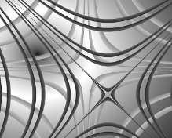

## VPixels
VPixels is a library that can be used to generate BMP and animated GIF images.
VPixels allows access to pixels. Use your imagination and creativity, you can
write programs to generate images as the following examples.

  

Written in C++, VPixels also provides programming interfaces to scripting language
Lua and Python. You can write your programs in C++, Lua or Python.

## License
GNU General Public License version 3 or any later version.
Please see license terms in file COPYING.

## Directories
```
  example/  - examples of using VPixels in C++, Lua and Python
  include/  - C++ header files
  src/      - C++ source files
  test/     - tests
  cmake/    - files for CMake build
```

## Build and Install

If you use Windows and do not want to build from source, you can download Windows DLL
files from [releases](https://github.com/xmartin-yao/vpixels/releases).
Simply save them to the same directory where your Lua or Python scripts are located.
Alternatively, save `vpixels.dll` to the directory where Lua interpreter is installed,
if you use Lua; or save `vpixels.pyd` to the directory `<Python Installation>/Lib/site-packages/`,
if you use Python. 

### Prerequisite
* [Lua 5.2](https://www.lua.org/ftp/)
* [Python 2.7](https://www.python.org/downloads/)

### Optional (for running tests)
* [CppUnit](https://freedesktop.org/wiki/Software/cppunit/)
* [LuaUnit](https://github.com/bluebird75/luaunit)
* PyUnit

### Build with Autotools
1. Clone the repository
2. Change to the directory `vpixels/`
3. Create directory `m4/`
4. Download [ax_cxx_compile_stdcxx.m4](https://www.gnu.org/software/autoconf-archive/ax_cxx_compile_stdcxx.html)
   and save it into directory `m4/`
5. Generate configuration files
    ``` sh
    $ autoreconf -i
    ```
6. Create a build directory (e.g. `_build`) and change to it
7. Configure the package (run `../configure --help` for options)
    ``` sh
    $ ../configure
    ```
8. Build and install the package
    ``` sh
    $ make && make install
    ```
9. Run tests (optional)
    ``` sh
    $ make check
    ```
### Build with CMake
1. Clone the repository
2. Change to the directory `vpixels/`
3. Create a build directory (e.g. `_build`) and change to it
4. Configure the package (e.g. `cmake .. -G "Unix Makefiles"`)
5. Build the package
    ``` sh
    $ make
    ```
6. Run tests (optional)
    ``` sh
    $ make check
    ```

## Lua API
Please see examples in directory `example/lua/`

### Import VPixels module
```
   vpixels = require("vpixels")
```

### Methods of BMP object
* Create a BMP object
```
     bmp = vpixels.bmp(bpp, w, h)  -- create a bmp object 
     -- bpp: bits/pixel, support 1, 4, 8 and 24
     -- w: image width
     -- h: image height

     bmp = vpixels.bmp()   -- create a bmp object, bpp = 1, w = 1, h = 1

     bmp = bmp_old:clone() -- create a bmp object from an existing one
```

* Import from/export to a BMP file
```
     bmp:import("file_name.bmp")
     bmp:export("file_name.bmp", ow)
     -- ow: optional. if true, allow overwriting; default = false
```

* Queries
```
     bpp = bmp:bitsperpixel()  -- query bits/pixel
     bpp = bmp:bpp()           -- same as bmp:bitsperpixel()

     w = bmp:width()           -- query image width
     h = bmp:height()          -- query image height
     w, h = bmp:dimension()    -- query image width and height
```

* Access color table, when bits/pixel = 1, 4, or 8
```
     size = bmp:colortablesize() -- get color table size

     bmp:setcolortable(i, b, g, r) -- set a color table entry
     bmp:setcolor(i, b, g, r)      -- same as bmp:setcolortable( i, b, g, r )

     b, g, r = bmp:getcolortable( i ) -- get a color table entry
     b, g, r = bmp:getcolor(i)        -- same as bmp:getcolortable(i)

     -- size: color table size (i.e. the number of entries)
     -- i: index of the entry, within range [0, size)
     -- b: blue channel, within range [0, 255]
     -- g: green channel, within range [0, 255]
     -- r: red channel, within range [0, 255]
```

* Access pixels, when bits/pixel = 1, 4, or 8
```
     bmp:setallpixels(i)     -- set all pixels to the same color
     bmp:setall(i)           -- same as bmp:setallpixels(i)

     bmp:setpixel(x, y, i)   -- set color of a pixel

     i = bmp:getpixel(x, y)  -- get color of a pixel

     -- i: index of a color table entry, within range [0, size)
     -- x: x coordinate of the pixel, within range [0, width)
     -- y: y coordinate of the pixel, within range [0, height)
```

* Access pixels, when bits/pixel = 24
```
     bmp:setallpixels(b, g, r)     -- set all pixels to the same color
     bmp:setall(b, g, r)           -- same as bmp:setallpixels(b, g, r)

     bmp:setpixel(x, y, b, g, r)   -- set color of a pixel

     b, g, r = bmp:getpixel(x, y)  -- get color of a pixel

     -- b: blue channel, within range [0, 255]
     -- g: green channel, within range [0, 255]
     -- r: red channel, within range [0, 255]
     -- x: x coordinate of the pixel, within range [0, width)
     -- y: y coordinate of the pixel, within range [0, height)
```

### Methods of GIF object
* Create a GIF object
```
     gif = vpixels.gif(bpp, w, h, n, g)  -- create a GIF object
     -- bpp: bits/pixel, within range [2, 8]
     -- w: GIF canvas width
     -- h: GIF canvas height
     -- n: number of images(frames)
     -- g: global color table, when g = true

     gif = vpixels.gif(bpp, w, h)  -- create a GIF object, n = 1, g = true

     gif = vpixels.gif()    -- create a GIF object, bpp = 2, w = 1, h = 1, n = 1, g = true

     gif = gif_old:clone()  -- create a GIF object from existing one
```

* Import from/export to a GIF file
```
     gif:import("file_name.gif")
     gif:export("file_name.gif", ow)
     -- ow: optional. if true, allow overwriting; default = false
```

* Queries
```
     v = gif:version()         -- query GIF version

     bpp = gif:bitsperpixel()  -- query bits/pixel
     bpp = gif:bpp()           -- same as gif:bitsperpixel()

     w = gif:width()           -- query GIF canvas width
     h = gif:height()          -- query GIF canvas height
     w, h = gif:dimension()    -- query GIF canvas width and height
```

* Access global color table
```
     gif:colortable() -- true, if the GIF object has a global color table

     gif:colortablesize(size)    -- set color table size
     size = gif:colortablesize() -- get color table size

     gif:setcolortable(i, r, g, b) -- set a color table entry
     gif:setcolor(i, r, g, b)      -- same as gif:setcolortable( i, r, g, b )

     r, g, b = gif:getcolortable( i ) -- get a color table entry
     r, g, b = gif:getcolor(i)        -- same as gif:getcolortable(i)

     -- size: color table size (i.e. the number of entries)
     -- i: index of the entry, within range [0, size)
     -- r: red channel, within range [0, 255]
     -- g: green channel, within range [0, 255]
     -- b: blue channel, within range [0, 255]
```

* Access images(frames)
```
     n = gif:images() -- get the number of images(frames)
     n = #gif         -- same as gif:images()

     img = gif:image(i) -- get an image(frame)
     img = gif[i]       -- same as gif:image(i)

     -- n: number of images(frames)
     -- i: index of the image(frame), within range [0, n)
     -- img: image(frame) at index i
```

### Methods of GIF image(frame) object

* Copy a GIF image(frame) object
```
     img2:clone(img1)  -- img2 copies img1
```

* Queries
```
     bpp = img:bitsperpixel()  -- query bits/pixel of the image(frame)
     bpp = img:bpp()           -- same as img:bitsperpixel()

     l = img:left()            -- query x coordinate of the image(frame)
     t = img:top()             -- query y coordinate of the image(frame)

     w = img:width()           -- query width of the image(frame)
     h = img:height()          -- query height of the image(frame)
     w, h = img:dimension()    -- query width and height of the image(frame)
```

* Crop GIF image(frame)
```
    img:crop(l, t, w, h)

    -- l: x coordinate of the cropped image(frame), must be within GIF canvas
    -- t: y coordinate of the cropped image(frame), must be within GIF canvas
    -- w: with of the cropped image(frame), l + w must be within GIF canvas
    -- h: height of the cropped image(frame), t + h must be within GIF canvas
```

* Access local color table
```
     img:colortable() -- true, if the image(frame) has a local color table

     img:colortablesize(size)    -- set color table size
     size = img:colortablesize() -- get color table size

     img:setcolortable(i, r, g, b) -- set a color table entry
     img:setcolor(i, r, g, b)      -- same as bmp:setcolortable( i, r, g, b )

     r, g, b = img:getcolortable( i ) -- get a color table entry
     r, g, b = img:getcolor(i)        -- same as bmp:getcolortable(i)

     -- size: color table size (i.e. the number of entries)
     -- i: index of the entry, within range [0, size)
     -- r: red channel, within range [0, 255]
     -- g: green channel, within range [0, 255]
     -- b: blue channel, within range [0, 255]
```

* Access pixels
```
     img:setallpixels(i)     -- set all pixels to the same color
     img:setall(i)           -- same as img:setallpixels(i)

     img:setpixel(x, y, i)   -- set color of a pixel

     i = img:getpixel(x, y)  -- get color of a pixel

     -- i: index of a color table entry, within range [0, size)
     -- x: x coordinate of the pixel, within range [0, width)
     -- y: y coordinate of the pixel, within range [0, height)
```

## Python API
Please see examples in directory `example/py/`

The signatures of the methods of Python API are almost the same as those of Lua API,
except the following that differ.

* Because _**import**_ is reserved in Python, use _**importf**_
instead as the name of the methods.
```
     bmp.importf("file_name.bmp")  # import from a BMP file
     gif.importf("file_name.gif")  # import from a GIF file
```

* Python does not have operator **#**, use _**len**_ instead.
```
     n = len(gif)  # get the number of images(frames)
```

However, it is worth mentioning that Python uses _**dot**_ when calling a method of an object, e.g.
```
  w, h = bmp.dimesion()
```
while Lua uses _**colon**_, e.g.
```
  w, h = bmp:dimesion()
```